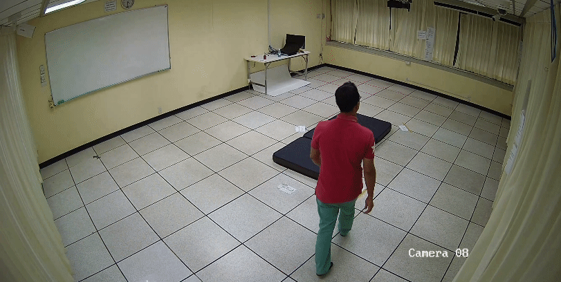

# SAFER Activities Dataset Code Repository

<table>
  <tr>
    <td></td>
    <td></td>
  </tr>
  <tr>
    <td></td>
    <td></td>
  </tr>
</table>

This repository includes scripts for preprocessing videos to generate pickle files and training.

Download the wheelchair keypoints dataset for human pose estimation through [this link](https://drive.google.com/file/d/1e6hAK0bHMI6P975IrIGWR7T1wC0HNLH6/view?usp=drive_link).

Download samples from the SAFER Activities Dataset through [this link](https://drive.google.com/file/d/1k43qv3mzfPDO3ot09Rj6QFe13qdQs6Qr/view?usp=drive_link).

Download the pickle files for training models using keypoint information through [this link](https://drive.google.com/file/d/1SHKJDlHRIG36eWcjQRplsNQ9jGWrxbMp/view?usp=drive_link).

Download example label visualizations on videos through [this link](https://drive.google.com/file/d/1tRL328B4cJWH3g8Re4prEsIJj8mK_YU9/view?usp=drive_link).

## Repository Structure

The repository is organized into three main folders:

- `preprocessing`: Contains code for preprocessing videos to generate pickle files with keypoints. We used the ViTPose-h-multi and Yolov8x models for our preprocessing. 

- `keypoints_train`: Contains code to train our Simple-1D-CNN. This folder includes all necessary scripts to start the training process and evaluate the model's performance on our dataset.

- `inference`: Contains code to run inference, as well as run evalation on the SAFER-Activities test set. Additionally includes evaluation code to run inference on other realistic fall datasets.

- `docker`: Includes a `Dockerfile` and `run_container.sh` script.

## License

This dataset is licensed under the [Creative Commons Attribution-NonCommercial-ShareAlike 4.0 International License (CC BY-NC-SA 4.0)](https://creativecommons.org/licenses/by-nc-sa/4.0/).
This means you can share and adapt the material for any non-commercial purpose as long as you provide appropriate credit, include a link to the license, and indicate if changes were made. You must also share any adaptations under the same license.

