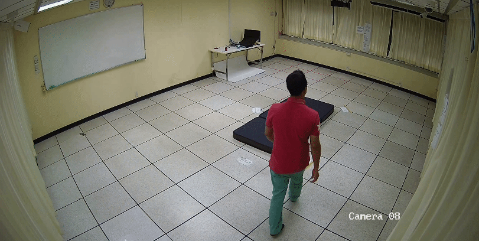

# SAFER Activities Dataset Code Repository

<table>
  <tr>
    <td></td>
    <td></td>
  </tr>
  <tr>
    <td></td>
    <td></td>
  </tr>
</table>

## Example Falls from Public Videos

<table>
  <tr>
    <td></td>
    <td></td>
  </tr>
  <tr>
    <td></td>
    <td></td>
  </tr>
</table>

Source for non-wheelchair falls: [FailArmy YouTube Channel](https://www.youtube.com/@failarmy)
Source for wheelchair fall: [YouTube Video](https://www.youtube.com/watch?v=tL34DvqCVNs)

This repository includes scripts for preprocessing videos to generate pickle files and training.

Download the wheelchair keypoints dataset for human pose estimation through [this link](https://drive.google.com/file/d/1e6hAK0bHMI6P975IrIGWR7T1wC0HNLH6/view?usp=drive_link).

Download the pickle files for training models using keypoint information through [this link](https://drive.google.com/file/d/10eY5oPk-LOqwCM2e1uRqGMsKDpxOL00_/view?usp=drive_link).

Download example label visualizations on videos through [this link](https://drive.google.com/file/d/1tRL328B4cJWH3g8Re4prEsIJj8mK_YU9/view?usp=drive_link).

## Repository Structure

- `preprocessing/` — Generate pickle files with 2D keypoints from raw videos (YOLOv8x + ViTPose-H)
- `preprocessing/3d_pose_lifting/` — Lift 2D keypoints to 3D using MotionAGFormer
- `keypoints_train/` — Train and evaluate skeleton-based models (1D-CNN)
- `inference/pyskl/` — Train and evaluate GCN-based skeleton models (DG-STGCN, MSG3D, STGCN++, PoseC3D) with 2D and 3D pose
- `rgb/feature_extraction/` — Extract bbox-cropped clips and frozen CLIP, DINOv3, and VideoMAE features
- `rgb/training/` — Train and evaluate RGB-only and multimodal fusion models (5 fusion strategies x 3 backbones)
- `rgb/external_eval/` — Cross-dataset evaluation on ImViA fall detection dataset (RGB & fusion models)
- `inference/` — Sliding-window inference and evaluation on the SAFER-Activities test sets, including external fall datasets
- `docker/` — Dockerfile and container run scripts

## License

This dataset is licensed under the [Creative Commons Attribution-NonCommercial-ShareAlike 4.0 International License (CC BY-NC-SA 4.0)](https://creativecommons.org/licenses/by-nc-sa/4.0/).
This means you can share and adapt the material for any non-commercial purpose as long as you provide appropriate credit, include a link to the license, and indicate if changes were made. You must also share any adaptations under the same license.
